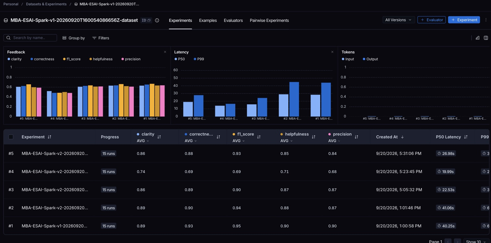
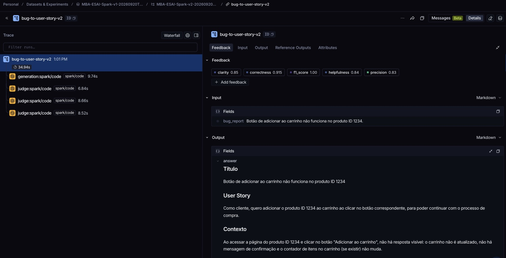

# Rodada homogênea de 20/09/2026 — juiz com contrato JSON

Todos os experimentos desta pasta usam a mesma configuração: `spark/code` gerando e julgando,
temperatura 0, `max_tokens` 4096, concorrência 1 e `response_format=json_object` **apenas no
juiz**. Todos avaliam o mesmo dataset de 15 exemplos originais
(`e76d86a5-6445-4b3c-8519-69f125650979`), o que permite comparar as versões lado a lado na
aba Experiments do LangSmith.

A rodada anterior foi interrompida no quarto exemplo porque o juiz devolveu JSON inválido.
Com o contrato imposto no transporte, as avaliações desta pasta rodaram sem nenhum
julgamento rejeitado.

## Arquivos

| Arquivo | Conteúdo |
|---|---|
| `v1.json` | Baseline: prompt original do Hub (`leonanluppi/bug_to_user_story_v1`). |
| `v2-iter1.json` | Prompt v2 como estava antes desta rodada (Hub `332d800a`). |
| `v2-iter2.json` | Iteração 2 (Hub `373f916c`). |
| `v2-iter3.json` | Iteração 3 (Hub `10109fda`). |

Cada relatório traz metadata com hashes dos insumos, `judge_response_format`, os 15 exemplos
com respostas e notas, as médias, os IDs de execução e as URLs de três traces verificados
remotamente. Os `.log` registram apenas progresso, sem credenciais.

## Jornada de otimização

O enunciado pede que as métricas baixas sejam analisadas e o prompt ajustado em seguida.
Cada iteração abaixo nasceu de um número observado na iteração anterior, não de suposição.

### Iteração 1 — ponto de partida

Prompt v2 com persona de Product Manager, few-shot de três exemplos e saída em cinco seções
(Título, User Story, Contexto, Critérios de aceitação, Dúvidas a esclarecer).

**Resultado:** todas as métricas acima de 0,8, mas abaixo do v1 em quatro das cinco. A
precision foi a mais distante (0,866 contra 0,904).

**Análise:** no exemplo 4, o v2 produziu 1.231 caracteres contra 447 da referência. Criou
critérios sobre filtros, ordenação e lista vazia, que o relato não menciona, e enviou para
"Dúvidas a esclarecer" justamente o que a referência trata como critério.

### Iteração 2 — restringir a especulação

**Hipótese:** se o excesso de conteúdo fora da referência derruba a precision, proibir
critérios não ancorados no relato deve recuperá-la.

**Mudança:** critérios obrigatoriamente ancorados no relato; "Dúvidas" apenas quando impedem
escrever um critério; contexto em uma frase. Os critérios dos exemplos few-shot foram
reescritos, porque demonstravam exatamente os cenários hipotéticos que a nova regra proíbe —
em few-shot, a demonstração costuma pesar mais que a instrução.

**Resultado:** precision subiu 0,005, f1_score caiu 0,036 e a média piorou. **Hipótese
rejeitada.**

**Análise:** a referência do dataset extrapola o relato por convenção. No exemplo 4 ela cita
administrador, tempo real e status "ativo", nenhum deles presente no texto do bug. Proibir a
extrapolação aumenta a aderência ao relato e reduz a cobertura da referência, que é o que o
recall mede.

### Iteração 3 — adotar o formato da referência

**Hipótese:** parte da perda de precision vem das seções que a referência não tem. Se a saída
passar a ter apenas User Story e Critérios de Aceitação, sobra menos texto fora do esperado.

**Mudança:** formato reduzido a `**User Story:**` e `**Critérios de Aceitação:**` em
Dado/Quando/Então, convenção de domínio permitida de volta, proibição explícita de citar
filtros, ordenação, exportação, relatório e permissão quando o relato não os usa. Few-shot e
role-prompting preservados, com os exemplos reescritos no formato novo.

**Resultado:** melhor que as iterações 1 e 2 em precision, helpfulness e correctness.

**Resultado:** pior de todas, 0,701 de média, com três casos zerados. Ao reescrever o YAML
do zero em vez de editá-lo, a regra para relatos com mais de um defeito independente se
perdeu. Os exemplos 13, 14 e 15 trazem vários defeitos por relato, e o exemplo 13 ainda
contém um payload `` como evidência do bug. Sem aquela regra, e
com o terceiro exemplo few-shot ensinando a recusar entradas adversariais, o modelo recusou
os três. **Hipótese rejeitada.**

Mesmo desconsiderando os três casos recusados, a iteração 3 perde para o v1 em todas as
métricas nos doze restantes (0,839 contra 0,908). O problema não foi apenas a recusa.

### Iteração 4 — cobertura sobre a melhor versão

**Hipótese:** o v1 vence sobretudo no f1_score, que carrega o recall. Se a iteração 1 receber
mais cobertura por critério, o recall sobe sem desmontar o que já funciona.

**Mudança:** a partir da iteração 1, não da 3. O que cabe como critério deixa de virar
dúvida, a convenção de domínio passa a ser explicitamente permitida e cada história passa a
ter de cinco a sete critérios.

**Resultado:** 0,872 — acima das iterações 2 e 3, ainda abaixo da iteração 1. **Hipótese
rejeitada.**

### Teste complementar — trocar o modelo gerador

O gateway expõe dezoito modelos. Com o mesmo prompt e o mesmo juiz, `spark/best` ficou abaixo
de `spark/code` nos dois casos mais difíceis (0,699 contra 0,735 no exemplo 4; 0,872 contra
0,907 no exemplo 13) e `spark/glm` não completou a avaliação. `spark/best` e `spark/reason`
devolveram saídas de tamanho e nota idênticos com temperatura 0, indício de que o gateway os
encaminha para o mesmo destino — a consulta direta que confirmaria isso não foi conclusiva.
Trocar o gerador não melhorou o resultado e **nenhuma métrica da entrega vem desse teste**.

## Resultado consolidado

| Métrica | v1 (baseline) | v2 iter. 1 | v2 iter. 2 | v2 iter. 3 | v2 iter. 4 | Critério |
|---|---|---|---|---|---|---|
| Helpfulness | 0.899 | 0.880 | 0.867 | 0.710 | 0.848 | ≥ 0,80 |
| Correctness | 0.926 | 0.903 | 0.887 | 0.686 | 0.884 | ≥ 0,80 |
| F1-Score | 0.948 | 0.939 | 0.903 | 0.688 | 0.933 | ≥ 0,80 |
| Clarity | 0.895 | 0.895 | 0.863 | 0.737 | 0.861 | ≥ 0,80 |
| Precision | 0.904 | 0.866 | 0.871 | 0.683 | 0.835 | ≥ 0,80 |
| **Média das cinco** | **0.914** | **0.897** | **0.878** | **0.701** | **0.872** | ≥ 0,80 |

Quatro hipóteses foram testadas contra o mesmo dataset e o mesmo juiz. Nenhuma superou o
prompt da iteração 1, que é a versão entregue: **todas as cinco métricas acima de 0,8**.

A baseline v1 permanece com a melhor média. Registrar isso é mais útil do que escondê-lo: o
juiz compara a resposta com uma referência que extrapola o relato por convenção, e o v1
extrapola com liberdade porque quase não tem regras. As restrições que tornam o v2 mais
defensável para uso real — não inventar causa raiz, separar dúvidas, recusar injeção de
instruções — custam similaridade com essa referência específica.

## Capturas da interface

Os cinco experimentos sobre o mesmo dataset, cada um com 15 execuções e as médias das cinco
métricas: #1 é o v1, #2 a iteração 1 entregue, #3 a iteração 2, #4 a iteração 3 e #5 a
iteração 4. Os valores conferem com a tabela acima.

Um exemplo aberto: a árvore mostra a geração e os três julgamentos reais, e o painel traz os
cinco feedbacks daquele caso, a entrada e a saída. As capturas excluem a barra lateral, que
exibe dados da conta.

## Limites desta rodada

Os arquivos `.log` das execuções não são versionados (`*.log` está no `.gitignore`); o
progresso verificável está nos relatórios JSON. Os números acima são de execuções reais com
feedback conferido remotamente, mas não constituem aprovação acadêmica: a avaliação é da
instituição.
